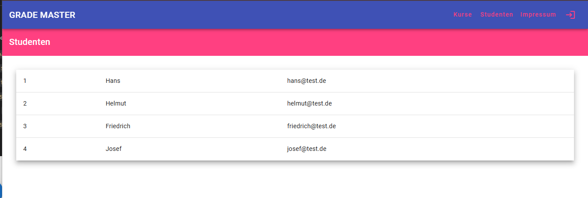
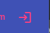
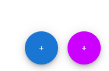
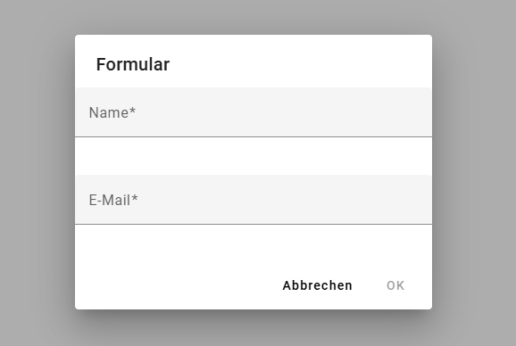
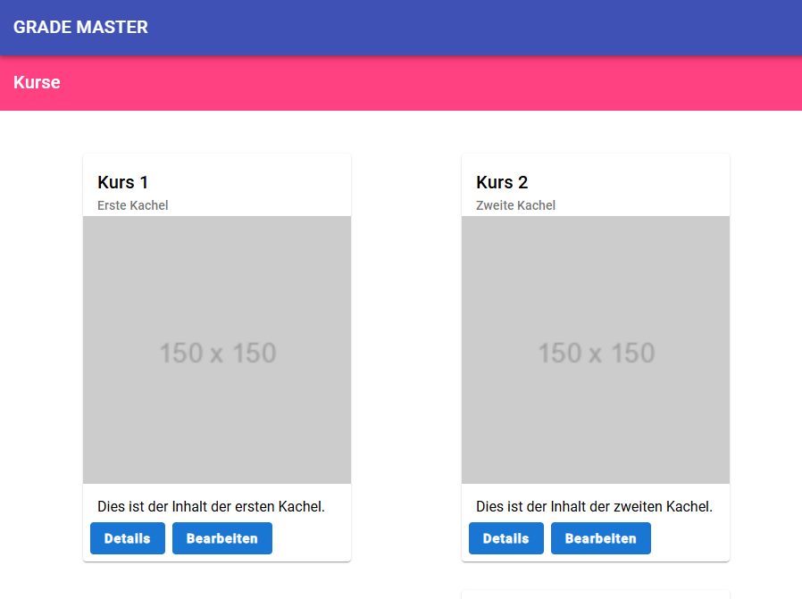

# GradeMasterUi

## Inhalt

### UI Elemente

Alle aufwändigeren UI-Elemente wurden mit [Angular Material](https://material.angular.io/) umgesetzt. (Guides, Tutorial und Beispiele)

- Toolbar: `mat-toolbar` - https://material.angular.io/components/toolbar/overview

  - `course` und `student` component

- Tabelle: `table` / `mat-table` - https://material.angular.io/components/table/overview

  - `student-list` component
  - 

- Buttons: `buttons` / `mat-button` - https://material.angular.io/components/button/overview

  - `student-list`, `course-overview` und `menu-bar`
  - 
  - 

- Dialoge: `MatDialogModule` / `MatMatDialogRef`, ... - https://material.angular.io/components/dialog/overview

  - `student-dialog` und `course-dialog`
  - 
  - "...am besten die Beispiele konsumieren"

- Cards: `mat-card`, `mat-card-header`, ... - https://material.angular.io/components/card/overview

  - `course-overview`
  - 

- Forms: `mat-form-field` / `mat-label` - https://material.angular.io/components/form-field/overview
  - `student-dialog` und `course-dialog` in Form von `inputs`, `labels`, `textarea`, ...

### Patterns / Best Practices

- eine Art der 3-Schichten Struktur:
  - Components (Views)
  - Domain (Models)
  - Core-Sevices (Business Layer)
  - Provider-Services (Data Access Layer)
  ```
            +-------------------+                      +----------------------+
            |                   |                       |                      |
            |    Externe        |<=====================>|  Provider-Services   |
            | Model-Entities    |                       |                      |
            |                   |                       +----------------------+
            +-------------------+                                      ^
                                                                       |
                +------------------------------------------------------+
                |
                v
    +--------------------------------+       +-----------------------------+
    |                                |       |                             |
    |           Core-Services        |<----->|         Models              |
    |                                |       | (Shared by Core and Views)  |
    |    - Business-Logik            |       |                             |
    |    - Zugriff auf Models        |       |                             |
    +--------------------------------+       +-----------------------------+
                    ^
                    |
                    |
                    v
    +----------------------------------+
    |                                  |
    |        Components / Views        |
    |                                  |
    |    - Präsentation & UI-Logik     |
    |    - Nutzung von Core-Services   |
    |                                  |
    +----------------------------------+
  ```

### Routing

- `app.routes.ts`: Definition der Routen

- Möglichkeiten des Aufrufs aus dem HTML-Coder heraus (Template) oder aus dem Typescript-Code ("Code behind" / Component Logic):
  - Typescript
    ```ts
    this.route.navigate(...)
    ```
  - HTML
    ```html
    <button [routerLink]="['../', id, 'details']"></button>
    ```
- `auxiliary-routes` oder auch `secondary-routes` genannt (kurz: `aux-routes`) sind eine Möglichkeit parallel andere routing-trees aufzubauen:

  - Definition in `app.routes.ts`:
  - Deklaration:

    ```html
    <!-- app.component.ts -->
    <div class="header">
      <app-menu-bar [title]="title" [menuBarItems]="menuItems" />
    </div>
    <div class="content">
      <!-- normale route -->
      <router-outlet></router-outlet>
      <!-- aux route -->
      <router-outlet name="dialog"></router-outlet>
    </div>
    ```

  - Möglichkeiten des Aufrufs: (bspw. auch in `ourse-overview` component)

    - HTML

      ```html
      <!-- normale route -->
      <button mat-button [routerLink]="['../', card.id, 'details']">Details</button>

      <!-- aux route -->
      <button mat-button [routerLink]="[{ outlets: { dialog: ['dialog'] } }]">Bearbeiten</button>
      ```

    - Typescript

      ```ts
      // normale route
      this.router.navigate(["/courses", card.id, "details"]);

      // aux route
      this.router.navigate([{ outlets: { dialog: ["dialog"] } }]);
      ```

### Formulare

Umsetzung via `ReactiveForms` welches fester Bestandteil des Angular Frameworks ist:

- Features:

  - Built in Validatoren wie `required`, `email`, ...
  - FormState abfragbar / manipulierbar: `this.form.valid` / `this.form.setValue(...)`

- Integration in Template und Typescript Code

  - Template

    ```html
    <form [formGroup]="form">
      <mat-form-field appearance="fill" style="width: 100%; margin-bottom: 20px">
        <mat-label>Name</mat-label>
        <input matInput formControlName="name" />
      </mat-form-field>

      <mat-form-field appearance="fill" style="width: 100%; margin-bottom: 20px">
        <mat-label>E-Mail</mat-label>
        <input matInput formControlName="email" />
      </mat-form-field>

      <div mat-dialog-actions align="end">
        <button mat-button mat-dialog-close>Abbrechen</button>
        <button mat-button (click)="onSubmit()" [mat-dialog-close]="form.value" [disabled]="form.invalid">OK</button>
      </div>
    </form>
    ```

    - Typescript

    ```ts

    export class ... {


        form: FormGroup;

        constructor(
            private fb: FormBuilder,
            ...
        ) {

            this.form = this.fb.group({
                name: ['', Validators.required],
                email: ['', [Validators.required, Validators.email]]
            });

        }

        onSubmit() {
            ...
        }
    }
    ```

###

## Entwicklung

This project was generated with [Angular CLI](https://github.com/angular/angular-cli) version 18.0.2.

### Development server

Run `ng serve` for a dev server. Navigate to `http://localhost:4200/`. The application will automatically reload if you change any of the source files.

### Code scaffolding

Run `ng generate component component-name` to generate a new component. You can also use `ng generate directive|pipe|service|class|guard|interface|enum|module`.

### Build

Run `ng build` to build the project. The build artifacts will be stored in the `dist/` directory.

### Running unit tests

Run `ng test` to execute the unit tests via [Karma](https://karma-runner.github.io).

### Running end-to-end tests

Run `ng e2e` to execute the end-to-end tests via a platform of your choice. To use this command, you need to first add a package that implements end-to-end testing capabilities.

### Further help

To get more help on the Angular CLI use `ng help` or go check out the [Angular CLI Overview and Command Reference](https://angular.dev/tools/cli) page.

```

```
